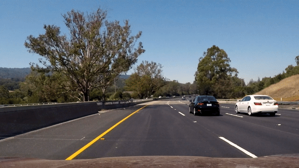
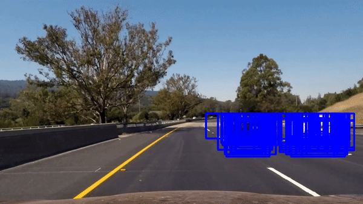
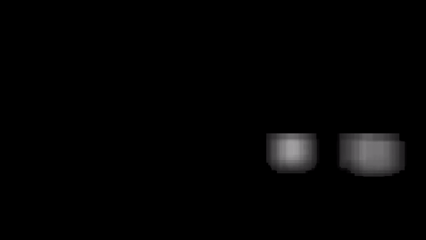
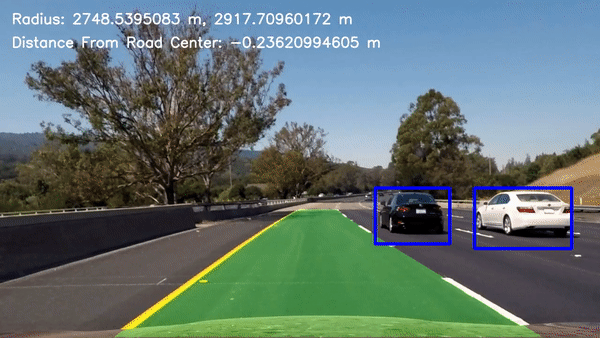

# **Advanced Lane and Vehicle Detection**
---

## **Vehicle Detection Module**

The goals / steps of this project are the following:

* Perform a Histogram of Oriented Gradients (HOG) feature extraction on a labeled training set of images and train a classifier Linear SVM classifier
* Optionally, you can also apply a color transform and append binned color features, as well as histograms of color, to your HOG feature vector.
* Note: for those first two steps don't forget to normalize your features and randomize a selection for training and testing.
* Implement a sliding-window technique and use your trained classifier to search for vehicles in images.
* Run your pipeline on a video stream (start with the test_video.mp4 and later implement on full project_video.mp4) and create a heat map of recurring detections frame by frame to reject outliers and follow detected vehicles.
* Estimate a bounding box for vehicles detected.

[//]: # (Image References)
[image0]: ./output_images/test_gif.gif
[image1]: ./output_images/car_no_car.png
[image2]: ./examples/HOG_example.jpg
[image3]: ./output_images/search_boxes.png
[image4]: ./output_images/boxes_gif.gif
[image5]: ./examples/bboxes_and_heat.png
[image6]: ./examples/labels_map.png
[image7]: ./examples/output_bboxes.png
[video1]: ./project_video.mp4
[image8]: ./output_images/hog_feat0.png
[image9]: ./output_images/hog_feat1.png
[image10]: ./output_images/hog_feat2.png
[image11]: ./output_images/hog_feat3.png
[image12]: ./output_images/hog_feat4.png
[image13]: ./output_images/spatial_feat0.png
[image14]: ./output_images/spatial_feat1.png
[image15]: ./output_images/spatial_feat2.png
[image16]: ./output_images/spatial_feat3.png
[image17]: ./output_images/spatial_feat4.png
[image18]: ./output_images/histogram0.png
[image19]: ./output_images/histogram1.png
[image20]: ./output_images/histogram2.png
[image21]: ./output_images/histogram3.png
[image22]: ./output_images/histogram4.png

### [Rubric](https://review.udacity.com/#!/rubrics/513/view) Points
#### Here I will consider the rubric points individually and describe how I addressed each point in my implementation.  

---

## _**In order to run this project's IPython notebook properly it is necessary to download and place the vehicle and nonvehicle images in their respective folders as mentioned below.**_

I downloaded the [vehicle](https://s3.amazonaws.com/udacity-sdc/Vehicle_Tracking/vehicles.zip) and [nonvehicle](https://s3.amazonaws.com/udacity-sdc/Vehicle_Tracking/non-vehicles.zip) datasets and extracted them in the `Vehicle-Detection-Data` folder in the `Vehicle-Detection-Data\vehicles` and `Vehicle-Detection-Data\nonvehicles`. I then read in all the `vehicle` and `non-vehicle` images. So we have the following folders containing the respective vehicle and nonvehile images.

**Folders containing nonvehicle images.**

* `Vehicle-Detection-Data/nonvehicles/GTI/*.png`
* `Vehicle-Detection-Data/nonvehicles/Extras/*.png`

**Folders containing vehicle images.**
* `Vehicle-Detection-Data/vehicles/GTI_Far/*.png`
* `Vehicle-Detection-Data/vehicles/GTI_Left/*.png`
* `Vehicle-Detection-Data/vehicles/GTI_Right/*.png`
* `Vehicle-Detection-Data/vehicles/GTI_MiddleClose/*.png`
* `Vehicle-Detection-Data/vehicles/KITTI_extracted/*.png`

Here is an example of one of each of the `vehicle` and `non-vehicle` classes:

![alt text][image1]

### **Features used to train the SVM**

#### Histogram of Oriented Gradients (HOG)

I extracted HOG features and used them to train my Support Vector classifier (SVC). I used the following function to extract HOG features for a single channel (I fed the Y, Cr and Cb channels one by one to get HOG features for all of them):

```python
def get_hog_features(img, orient, pix_per_cell, cell_per_block,
                        vis=False, feature_vec=True):
    # Call with two outputs if vis==True
    if vis == True:
        features, hog_image = hog(img, orientations=orient,
                                  pixels_per_cell=(pix_per_cell, pix_per_cell),
                                  cells_per_block=(cell_per_block, cell_per_block),
                                  transform_sqrt=False,
                                  visualise=vis, feature_vector=feature_vec)
        return features, hog_image
    # Otherwise call with one output
    else:      
        features = hog(img, orientations=orient,
                       pixels_per_cell=(pix_per_cell, pix_per_cell),
                       cells_per_block=(cell_per_block, cell_per_block),
                       transform_sqrt=False,
                       visualise=vis, feature_vector=feature_vec)
        return features
```

This function is present in the code cell under the **All Helper Functions** heading in the _Advanced Lane and Vehicle Finding Modules Notebook_.
I extracted HOG features using **9** `orientations`, **8** `pixels_per_cell`, **2** `cells_per_block` and the **YCrCb** `color_space`.
Here are a few examples of the HOG features I used,

![hog_example 1][image8]
![hog_example 2][image9]
![hog_example 3][image10]
![hog_example 4][image11]
![hog_example 5][image12]

**How did I reach these final HOG parameters?**

I reached these parameters after a lot of trial and error and considering both speed and accuracy and making a compromise between them. The **YCrCb** color space gave me the best results.

#### Also used Spacial and Color Histogram features:

I also used spatial and color features to train my SVM classifier. I used **32x32** spatial bins in `YCrCb` color space and **64** color histogram bins also for all three channels in the `YCrCb` color space.

I used the following Helper functions (present in the code block under the **All Helper Functions** heading in the Project notebook) for extracting spatial and color histogram features respectively.

```python
def bin_spatial(img, size=(32, 32)):
    color1 = cv2.resize(img[:,:,0], size).ravel()
    color2 = cv2.resize(img[:,:,1], size).ravel()
    color3 = cv2.resize(img[:,:,2], size).ravel()
    return np.hstack((color1, color2, color3))
```

```python
def color_hist(img, nbins=32):    #bins_range=(0, 256)
    # Compute the histogram of the color channels separately
    channel1_hist = np.histogram(img[:,:,0], bins=nbins)
    channel2_hist = np.histogram(img[:,:,1], bins=nbins)
    channel3_hist = np.histogram(img[:,:,2], bins=nbins)
    # Concatenate the histograms into a single feature vector
    hist_features = np.concatenate((channel1_hist[0], channel2_hist[0], channel3_hist[0]))
    # Return the individual histograms, bin_centers and feature vector
    return hist_features
```
Here are some examples of the spatial features I used,

![spatial_example 1][image13]
![spatial_example 2][image14]
![spatial_example 3][image15]
![spatial_example 4][image16]
![spatial_example 5][image17]

Here are some examples of the color histogram features I used,

![spatial_example 1][image18]
![spatial_example 2][image19]
![spatial_example 3][image20]
![spatial_example 4][image21]
![spatial_example 5][image22]


### **Training My SVC**
I trained a linear SVM using a feature vectors of length 8556 extracted from the car and notcar examples. I wrote the following function(which can be found under the **Get a trained SVM model for detecting Cars** in the Project Notebook),

```python
def get_trained_model(cars, notcars, color_space, orient, pix_per_cell, cell_per_block, hog_channel, spatial_size, hist_bins, spatial_feat, hist_feat, hog_feat, test_size = 0.2):
    car_features = extract_features(cars, color_space=color_space,
                            spatial_size=spatial_size, hist_bins=hist_bins,
                            orient=orient, pix_per_cell=pix_per_cell,
                            cell_per_block=cell_per_block,
                            hog_channel=hog_channel, spatial_feat=spatial_feat,
                            hist_feat=hist_feat, hog_feat=hog_feat)
    notcar_features = extract_features(notcars, color_space=color_space,
                            spatial_size=spatial_size, hist_bins=hist_bins,
                            orient=orient, pix_per_cell=pix_per_cell,
                            cell_per_block=cell_per_block,
                            hog_channel=hog_channel, spatial_feat=spatial_feat,
                            hist_feat=hist_feat, hog_feat=hog_feat)

    X = np.vstack((car_features, notcar_features)).astype(np.float64)                        
    # Fit a per-column scaler
    X_scaler = StandardScaler().fit(X)
    # Apply the scaler to X
    print(X[0].shape)
    scaled_X = X_scaler.transform(X)

    # Define the labels vector
    y = np.hstack((np.ones(len(car_features)), np.zeros(len(notcar_features))))


    # Split up data into randomized training and test sets
    rand_state = np.random.randint(0, 100)
    X_train, X_test, y_train, y_test = train_test_split(
        scaled_X, y, test_size=0.2, random_state=rand_state)

    print('Using:',orient,'orientations',pix_per_cell,
        'pixels per cell and', cell_per_block,'cells per block')
    print('Feature vector length:', len(X_train[0]))
    # Use a linear SVC
    svc = LinearSVC()
    # Check the training time for the SVC
    t=time.time()
    svc.fit(X_train, y_train)
    t2 = time.time()
    print(round(t2-t, 2), 'Seconds to train SVC...')
    # Check the score of the SVC
    print('Test Accuracy of SVC = ', round(svc.score(X_test, y_test), 4))
    # Check the prediction time for a single sample
    t=time.time()

    return svc, X_scaler
```

After randomizing the data and using a test split of **20%** I got a test `accuracy` of upto **99.35%**. I saved the model in the `svm_model.pickle` file.

### **Sliding Window Search**

I used sliding window search with a `step_size` of **2** blocks and searched on **11** evenly distributed scales from **1.0** to **2.5**. I tried various scales and got the best speed and accuracy on these settings. I also reduced the portion of the in which search was performed depending on the scaling of the search windows  (i.e. the smaller the window size the smaller will the span of search). I use the following code to achieve this.

```python
scales = np.arange(min_scale, max_scale, ((max_scale-min_scale)/no_of_scales))
y_start_stops = []
    for scale in scales:
        y_start_stops.append([400, 400+1.5*scale*64])
```

the full `find_cars` function is available under the **Finding Cars on the given scale and vertical bounds** heading in the Vehicle detection portion of the project notebook.

![alt text][image3]

#### Initial results of sliding window search
After applying the `find_cars` function with scales and spans I mentioned I get the following result on the test video.


---

### **Heatmap and Reducing False Positives**

I generated a summed heatmap of the past 18 frames as follows (the full code can be found under the **Lane and Vehicle Finding Pipeline**)

```python
# Apply threshold to help remove false positives
heatmap_current = add_heat(heatmap_current, bbox_list)

self.heatmap_sum = self.heatmap_sum + heatmap_current
self.heatmaps.append(heatmap_current)

# subtract off old heat map to keep running sum of last 18 heatmaps
if len(self.heatmaps)>18:
    old_heatmap = self.heatmaps.pop(0)
    self.heatmap_sum -= old_heatmap
    self.heatmap_sum = np.clip(self.heatmap_sum,0.0,1000000.0)
```

The Summed Heatmap of the past 18 frames looks as follows,


In this case we do get some false positives and in order to eliminate them as much as possible without affecting the vehicle detection I chose a `heat_threshold` of **9** heat value.

```python
thresh_heat = apply_threshold(self.heatmap_sum, self.heat_thresh)
```

After applying the threshold I got the following resulting Heatmap.


I then used the `scipy.ndimage.measurements.label()` function on the thresholded heatmap to get the final bounding boxes for the cars. I used the following function (available under the **Heatmap Functions** heading in the project notebook) to draw the final label boxes on the frame.

```python
def draw_labeled_bboxes(img, labels):
    # Iterate through all detected cars
    for car_number in range(1, labels[1]+1):
        # Find pixels with each car_number label value
        nonzero = (labels[0] == car_number).nonzero()
        # Identify x and y values of those pixels
        nonzeroy = np.array(nonzero[0])
        nonzerox = np.array(nonzero[1])
        # Define a bounding box based on min/max x and y
        bbox = ((np.min(nonzerox), np.min(nonzeroy)), (np.max(nonzerox), np.max(nonzeroy)))
        # Draw the box on the image
        cv2.rectangle(img, bbox[0], bbox[1], (0,0,255), 6)
    # Return the image
    return img
```

After drawing the label boxes I got the following result.



## Here's a [link to my full project video result](./project_video_out.mp4)

---

#### **Discussion for the Vehicle Detection Module**
* During implementation of the Vehicle Detection Module I faced a hard time finding the right scales and search regions in the frames to get the best results.
* Deciding a good heat threshold was also a bit challenging as with a high threshold one is unable to get vehicle detections at all.
* The pipeline doesn't work well on vehicles that are far away.
* It could be made more robust by applying the searching on even more scales and by increasing the accuracy of the SVC model to reduce false detections.
* Another improvement would be prediction of the distance of the vehicle from the camera by using the scale of the vehicle or the scale of it's license plate.

---

---

---

## **Lane Detection Module**

The goal of this project is to detect lane lines in a video steam as accurately as possible and find the position of the vehicle on the road and the curvature of the road. This was achieved using the following steps.

#### Camera Calibration and Undistortion

I calibrated the camera using 20 images given by Udacity of a 10x7 chessboard. I extracted object points and image points from all the 20 images and fed them to the `calibrateCamera()` of OpenCV to get calibration and distortion matrices. Then I can apply the `undistort()` function to undistort every image.

```python
ret, mtx, dist, rvecs, tvecs = cv2.calibrateCamera(obj_pnts, img_pnts, gray.shape[::-1],None,None)

def undistort(image, matrix, distMatrix):
    gray = cv2.cvtColor(image, cv2.COLOR_RGB2GRAY)
    return cv2.undistort(image, matrix, distMatrix)
```


#### Perspective Transform
Using OpenCV's `getPerspectiveTransfrom()` function I extract the Perspective transform matrix and then using the `warpPerspective()` function I get a birds-eye view of the road.

```python
def warp(img, src, dst):
    M = cv2.getPerspectiveTransform(src, dst)
    Minv = cv2.getPerspectiveTransform(dst, src)
    warped = cv2.warpPerspective(img, M, img.shape[0:2][::-1], flags=cv2.INTER_LINEAR)
    return warped, Minv
```


#### Emphasizing Lane Lines
Using a combination of HSV and Gradient Thresholds we extract a binary image which emphasizes the lane lines from the warped image.

```python
def get_lanes(img):
    b_hs_yellow = get_hs_thresholded(img=img, h_thresh=(0,40), s_thresh=(80,255), v_thresh=(200,255))
    b_hs_white = get_hs_thresholded(img=img,h_thresh=(0,255), s_thresh=(0,40), v_thresh=(220,255))

    b = np.zeros_like(b_hs_yellow)

    b_grad = get_grad_thresh(img)

    b[(b_hs_white == 1)|(b_hs_yellow == 1)|(b_grad == 1)] = 1

    return b
```


#### Detecting the Lane Pixels
I detect the lane pixels using the [method](https://classroom.udacity.com/nanodegrees/nd013/parts/fbf77062-5703-404e-b60c-95b78b2f3f9e/modules/2b62a1c3-e151-4a0e-b6b6-e424fa46ceab/lessons/40ec78ee-fb7c-4b53-94a8-028c5c60b858/concepts/c41a4b6b-9e57-44e6-9df9-7e4e74a1a49a) given by Udacity. Using Histogram on vertical levels of the image, I find the maximum values in the Histogram and define a region around them and consider those pixels to be lanes.


```python
import numpy as np
import cv2
import matplotlib.pyplot as plt

# Assuming you have created a warped binary image called "binary_warped"
# Take a histogram of the bottom half of the image
histogram = np.sum(binary_warped[binary_warped.shape[0]/2:,:], axis=0)
# Create an output image to draw on and  visualize the result
out_img = np.dstack((binary_warped, binary_warped, binary_warped))*255
# Find the peak of the left and right halves of the histogram
# These will be the starting point for the left and right lines
midpoint = np.int(histogram.shape[0]/2)
leftx_base = np.argmax(histogram[:midpoint])
rightx_base = np.argmax(histogram[midpoint:]) + midpoint

# Choose the number of sliding windows
nwindows = 9
# Set height of windows
window_height = np.int(binary_warped.shape[0]/nwindows)
# Identify the x and y positions of all nonzero pixels in the image
nonzero = binary_warped.nonzero()
nonzeroy = np.array(nonzero[0])
nonzerox = np.array(nonzero[1])
# Current positions to be updated for each window
leftx_current = leftx_base
rightx_current = rightx_base
# Set the width of the windows +/- margin
margin = 100
# Set minimum number of pixels found to recenter window
minpix = 50
# Create empty lists to receive left and right lane pixel indices
left_lane_inds = []
right_lane_inds = []

# Step through the windows one by one
for window in range(nwindows):
    # Identify window boundaries in x and y (and right and left)
    win_y_low = binary_warped.shape[0] - (window+1)*window_height
    win_y_high = binary_warped.shape[0] - window*window_height
    win_xleft_low = leftx_current - margin
    win_xleft_high = leftx_current + margin
    win_xright_low = rightx_current - margin
    win_xright_high = rightx_current + margin
    # Draw the windows on the visualization image
    cv2.rectangle(out_img,(win_xleft_low,win_y_low),(win_xleft_high,win_y_high),(0,255,0), 2)
    cv2.rectangle(out_img,(win_xright_low,win_y_low),(win_xright_high,win_y_high),(0,255,0), 2)
    # Identify the nonzero pixels in x and y within the window
    good_left_inds = ((nonzeroy >= win_y_low) & (nonzeroy < win_y_high) & (nonzerox >= win_xleft_low) & (nonzerox < win_xleft_high)).nonzero()[0]
    good_right_inds = ((nonzeroy >= win_y_low) & (nonzeroy < win_y_high) & (nonzerox >= win_xright_low) & (nonzerox < win_xright_high)).nonzero()[0]
    # Append these indices to the lists
    left_lane_inds.append(good_left_inds)
    right_lane_inds.append(good_right_inds)
    # If you found > minpix pixels, recenter next window on their mean position
    if len(good_left_inds) > minpix:
        leftx_current = np.int(np.mean(nonzerox[good_left_inds]))
    if len(good_right_inds) > minpix:        
        rightx_current = np.int(np.mean(nonzerox[good_right_inds]))

# Concatenate the arrays of indices
left_lane_inds = np.concatenate(left_lane_inds)
right_lane_inds = np.concatenate(right_lane_inds)

# Extract left and right line pixel positions
leftx = nonzerox[left_lane_inds]
lefty = nonzeroy[left_lane_inds]
rightx = nonzerox[right_lane_inds]
righty = nonzeroy[right_lane_inds]

# Fit a second order polynomial to each
left_fit = np.polyfit(lefty, leftx, 2)
right_fit = np.polyfit(righty, rightx, 2)
```

Then I fit a polynomial to the points found and plot it.

```python
# Generate x and y values for plotting
ploty = np.linspace(0, binary_warped.shape[0]-1, binary_warped.shape[0] )
left_fitx = left_fit[0]*ploty**2 + left_fit[1]*ploty + left_fit[2]
right_fitx = right_fit[0]*ploty**2 + right_fit[1]*ploty + right_fit[2]

out_img[nonzeroy[left_lane_inds], nonzerox[left_lane_inds]] = [255, 0, 0]
out_img[nonzeroy[right_lane_inds], nonzerox[right_lane_inds]] = [0, 0, 255]
plt.imshow(out_img)
plt.plot(left_fitx, ploty, color='yellow')
plt.plot(right_fitx, ploty, color='yellow')
plt.xlim(0, 1280)
plt.ylim(720, 0)
```

#### Find Curvature of the lanes
If the curvature of the line is defined by

```python
A*y**2 + B*y + C
```

then, I can find the curvature of the lanes, using the following formula:

```python
Radius = (1 + (2*A*y + B)**2)**(3/2) / abs(2*A)
```

So using the following code I can find the curvature of the lane in meters.

```python
# Define conversions in x and y from pixels space to meters
ym_per_pix = 30/720 # meters per pixel in y dimension
xm_per_pix = 3.7/700 # meters per pixel in x dimension

# Fit new polynomials to x,y in world space
left_fit_cr = np.polyfit(ploty*ym_per_pix, leftx*xm_per_pix, 2)
right_fit_cr = np.polyfit(ploty*ym_per_pix, rightx*xm_per_pix, 2)
# Calculate the new radii of curvature
left_curverad = ((1 + (2*left_fit_cr[0]*y_eval*ym_per_pix + left_fit_cr[1])**2)**1.5) / np.absolute(2*left_fit_cr[0])
right_curverad = ((1 + (2*right_fit_cr[0]*y_eval*ym_per_pix + right_fit_cr[1])**2)**1.5) / np.absolute(2*right_fit_cr[0])
# Now our radius of curvature is in meters
print(left_curverad, 'm', right_curverad, 'm')
# Example values: 632.1 m    626.2 m
```


#### Warp the lanes back on to the image
I warp back the image to the Original one using the `Minv` matrix which we had gotten from the `getPerspectiveTransfrom()` function.

```python
# Warp the blank back to original image space using inverse perspective matrix (Minv)
newwarp = cv2.warpPerspective(color_warp, Minv, (img.shape[1], img.shape[0]))         
```


#### Plotting Curvature and lane distance on Resultant Image
I plot the distance from the left and right lane as well as the curvature on to the Resultant image as follows:

```python
# Define conversions in x and y from pixels space to meters
ym_per_pix = 30/720.0 # meters per pixel in y dimension
xm_per_pix = 3.7/700.0 # meters per pixel in x dimension

# Calculate the new radii of curvature
left_curverad = ((1 + (2*left_fit[0]*y_eval*ym_per_pix + left_fit[1])**2)**1.5) / np.absolute(2*left_fit[0])
right_curverad = ((1 + (2*right_fit[0]*y_eval*ym_per_pix + right_fit[1])**2)**1.5) / np.absolute(2*right_fit[0])

left_pos = (left_fit[0]*y_eval**2 + left_fit[1]*y_eval + left_fit[2])
right_pos = (right_fit[0]*y_eval**2 + right_fit[1]*y_eval + right_fit[2])

lanes_mid = (left_pos+right_pos)/2.0

distance_from_mid = binary_warped.shape[1]/2.0 - lanes_mid

mid_dist_m = xm_per_pix*distance_from_mid

curvature = 'Radius: '+ str(left_curverad) + ' m, ' + str(right_curverad) + " m"
lane_dist = 'Distance From Road Center: '+str(mid_dist_m)+' m'
font = cv2.FONT_HERSHEY_SIMPLEX
result = cv2.putText(result,curvature,(25,50), font, 1, (255,255,255),2,cv2.LINE_AA)
result = cv2.putText(result,lane_dist,(25,100), font, 1, (255,255,255),2,cv2.LINE_AA)
```


## Result
We got the following result after applying the pipeline to the `project_video.mp4`


#### Discussion for the Lane Detection Module

* I had a really hard time figuring out the right function for getting a binary image which emphasizes the lane lines.
* Also I think my lane finding pipeline can be improved greatly by Improving the stage where the lane lines are extracted from the binary image using a histogram.
* Also another improvement would be averaging with lane line from previous frames in order to get a smoother fit and reduce jitter.
